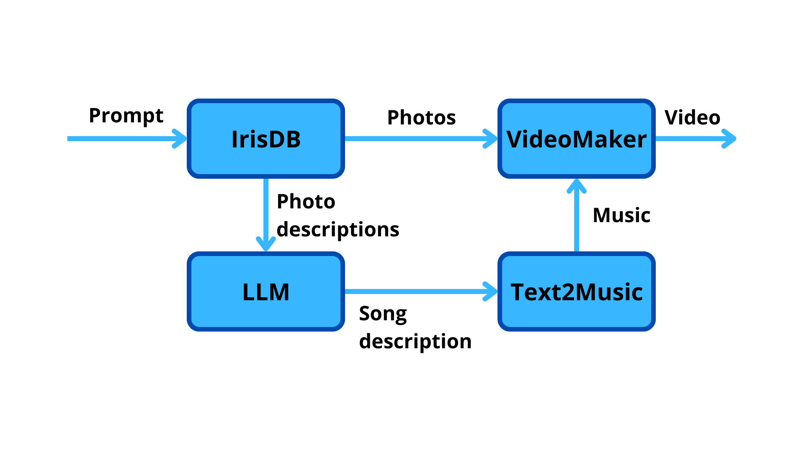

# Hackupc24_inter


## Description
The following photo shows the schema of the project. Our model is a text-to-video project, although we do not use a generative video model. Instead, we use the user's photos together with ai music generation to create a video. The user can upload photos, and the model will generate a video with the photos and music. The music is generated using the ai model, and the video is created using the photo and the music. The user can download the video and share it with friends. 



Moreover, we offer the functionality of selecting the photos and music using natural language. The user can write a sentence, and the model will select the photos and music based on the sentence, which makes it more user-friendly.

## Usage

After cloning the repo, stand on the main folder and do the following:

1. Install IRIS Community Edtion in a container:
    ```Shell
    docker run -d --name iris-comm -p 1972:1972 -p 52773:52773 -e IRIS_PASSWORD=demo -e IRIS_USERNAME=demo intersystemsdc/iris-community:latest
    ```
    :information_source: After running the above command, you can access the System Management Portal via http://localhost:52773/csp/sys/UtilHome.csp. Please note you may need to [configure your web server separately](https://docs.intersystems.com/iris20241/csp/docbook/DocBook.UI.Page.cls?KEY=GCGI_private_web#GCGI_pws_auto) when using another product edition.

2. Create a Python environment with conda and activate it:
    ```Shell
    conda create --name iris-vector-search python=3.10
    conda activate iris-vector-search
    ```

3. Install packages:
    ```Shell
    pip install -r requirements.txt
    conda install -c conda-forge ffmpeg
    ```

4. Put your OpenAI API and Replicate API key

Write your OpenAI API key in the OPENAI_API_KEY.txt file and your Replicate API key in the replicate_api.txt

5. Activate the streamlit demo
    ```Shell
    streamlit run ./demo/GalleryVideoclipGenerator.py
    ```

6. Now, you can generate your videoclips with the webUI! 
You have a page for uploading your images and one for generating the clips with them.